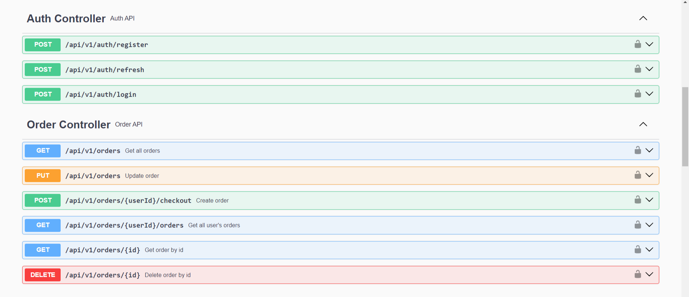

# Интернет-магазин обуви

## Обзор

**Веб-сервис**, реализующий упрощенный функционал интернет-магазина обуви.

## Стек

`Java 17`, `Maven`, `Spring (Web, Data, Security)`, `PostrgreSQL`, `Hibernate`, `Liquibase`, `JWT`, `MapStruct`, `Lombok`, `TestContainers`, `Mockito`, `Swagger`, `Docker`, `Minio`, `Mail`

## Реализованый функционал

### Aдминистратор

- Вход в систему
- Редактирование информации о пользователях
- Просмотр списка всех товаров в системе
- Добавление нового товара в систему
- Удаление товара из системы
- Редактирование информации о товаре
- Просмотр списка всех товаров в корзине клиента
- Добавление товара в корзину
- Удаление товара из корзины
- Редактирование информации о товарах в корзине
- Просмотр списка всех заказов клиента
- Добавление нового заказа
- Удаление заказа из системы
- Редактироваие заказа
- Выход из системы

### Пользователь

- Регистрация 
- Вход в систему
- Редактирование информации о себе
- Просмотр список всех товаров
- Добавление товара в корзину
- Удаление товара из корзины
- Осуществление заказа выбранных товаров 
- Выход из системы

## База данных

В качестве базы данных в приложении используется Postgres. ER-диаграмма изображена на рисунке:

## Rest API

В качестве API были реализованы следующие методы, которые изображены на рисунке:

## Email

Пример получения сообщения на почту в случае успешной регистрации:

Пример получения сообщения на почту в случае прибытия заказанного товара на ПВЗ:

## Связь

- **Email**: schebetovskiyvadim@gmail.com
- **Telegram**: [Vadim Schebetovskiy](https://t.me/VadimSchebet)
- **Вк:** [Щебетовский Вадим](https://vk.com/vadimschebetovskiy)
